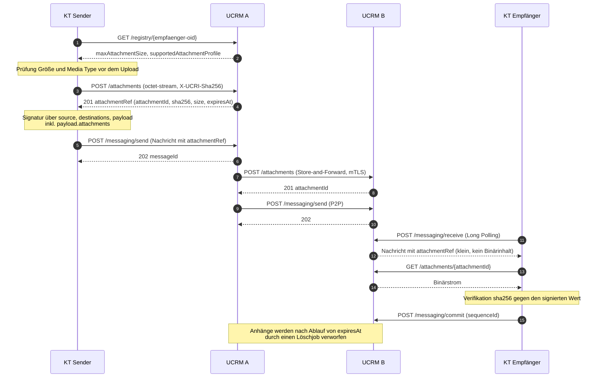

# API File Transfer

**Status**: 🤔 vorgeschlagen

**Autoren**: Philipp von Kirschbaum, Telekom LLMHub / GLM 5.2, akryukov378

**Datum**: 2026-08-11

**Betrifft**: Transportschicht (Vermittlungsebene), Client-API, P2P-API, KT-Register

---

## Kontext und Problemstellung

Aktuell können über die Transportschicht (Version 2.0) nur JSON-Nachrichten ausgetauscht werden.
Die einzige Möglichkeit eine Datei zu übermitteln ist eine Base64-Kodierung und die Einbettung in die
JSON-Nachricht (33 % Vergrößerung der Datei durch Base64).

Der Austausch von Dateien wird in Zukunft immer mehr an Relevanz gewinnen.
Anwendungsfälle sind u. a.:

- Rasterdaten (z. B. Drohnenbilder, Fahndungsbilder, ...)
- Dokumente (z. B. Einsatzpläne, Einsatzinformationen, ...)

Durch eine Implementierung in die Transportschicht haben alle Apps einen einheitlichen Mechanismus
um Dateien auszutauschen.

Eventuell braucht es dann zwischen Apps und Transportschicht eine Kompatibilitätsmatrix.

### Randbedingungen aus der bestehenden Spezifikation 2.0.0

Jede Lösung muss folgende UCRI2-Eigenschaften berücksichtigen:

| # | Randbedingung | Fundstelle |
|---|---|---|
| R1 | `payload.contentType` ist ein **geschlossenes Enum** (`application/json`, `application/jose`). | `api/crm/2.0.0/schemas/payload.yaml` |
| R2 | `payload.data` ist ein *String*, der das stringifizierte App-JSON trägt (trotz `format: binary`). | `api/crm/2.0.0/schemas/payload.yaml` |
| R3 | Das UCRM **muss** jeden Payload gegen das JSON-Schema der App validieren, sonst Fehler `464 REQUEST_PAYLOAD_INVALID_PER_APP_SPEC`. Binärinhalte benötigen einen expliziten Ausnahmepfad. | `staging/spec/client_api.md` |
| R4 | Aktueller Zustellkanal ist Long Polling `POST /messaging/receive` (dMax 30 s, `maxMessages`, monoton steigende `sequenceId`, Bestätigung über `POST /messaging/commit`). Es gibt kein Streaming und kein Byte-Range. | `staging/spec/client_api.md` |
| R5 | Ein KT, der 60 s nicht pollt, wird im KT-Register auf `offline` gesetzt. Lange belegte Verbindungen sind daher kritisch. | `staging/spec/client_api.md` |
| R6 | `senderRequest.destinations` ist auf **genau einen** Empfänger begrenzt (`minItems: 1`, `maxItems: 1`). | `api/crm/2.0.0/schemas/senderRequest.yaml` |
| R7 | Die Signatur wird über eine Kopie der Nachricht mit ausschließlich `source`, `destinations` und `payload` gebildet: JCS (RFC 8785) → SHA3-256 → Compact JWS (RS256). Alles, was nicht im `payload` steht, ist **nicht** signaturgeschützt. | `staging/spec/p2p_protocol.md` |
| R8 | Versionierung der Transportschicht `GEN.MAJOR.MINOR`: rein additive, optionale Erweiterungen sind MINOR und damit kompatibel; Änderungen an Pflichtfeldern sind MAJOR. | `staging/spec/versioning.md` |
| R9 | E2E-Verschlüsselung des Nachrichteninhalts wurde in 2.0 bewusst zurückgestellt (Begründung: durchgängiges TLS). | `staging/spec/architecture.md` |
| R10 | Netzarchitektur ist P-A-P nach BSI NET.1.1 mit Domain-Whitelisting am Paketfilter. Direkte Zugriffe eines KT auf beliebige externe Hosts sind nicht vorgesehen. | `staging/spec/system_integration.md` |

### Nicht-funktionale Anforderungen

- **Dateigrößen**: Drohnen- und Fahndungsbilder typischerweise 2–20 MB, Einsatzpläne als PDF 1–50 MB.
  Damit liegt die Nutzlast um zwei bis vier Größenordnungen über heutigen UCRI2-Nachrichten (typ. < 10 KB).
- **Bandbreite**: Leitstellenanbindungen sind teilweise schmalbandig und redundant ausgelegt; ein 50-MB-Transfer
  darf den Nachrichtenkanal für zeitkritische Einsatzmeldungen nicht blockieren.
- **Datenschutz**: Fahndungsbilder und patientenbezogene Dokumente unterliegen Zweckbindung, Aufbewahrungs-
  und Löschfristen. Eine Lösung muss gezieltes Löschen und eine begrenzte Vorhaltedauer erlauben.
- **Nachvollziehbarkeit**: Integrität und Urheberschaft einer Datei müssen ebenso belegbar sein wie die der Nachricht.
- **Verfügbarkeit**: Ein fehlgeschlagener Dateitransfer darf nicht dazu führen, dass die zugehörige Fachnachricht
  verloren geht oder unzustellbar wird.

---

## Entscheidungstreiber

| ID | Treiber |
|---|---|
| T1 | **Bandbreiten- und Speichereffizienz** — kein vermeidbarer Kodierungs-Overhead, keine Vervielfachung im Message-Store |
| T2 | **Robustheit des Zustellkanals** — Long Polling (R4, R5) darf nicht durch große Nutzlasten destabilisiert werden |
| T3 | **Rückwärtskompatibilität** — MINOR statt MAJOR (R8); bestehende KT müssen ohne Anpassung weiterlaufen |
| T4 | **Implementierungsaufwand** in UCRM und KT, inkl. Testbarkeit und Anzahl paralleler Codepfade |
| T5 | **Signatur- und Integritätsfähigkeit** — Datei muss vom bestehenden Signaturverfahren (R7) mit abgedeckt werden können |
| T6 | **Datenschutz und Löschbarkeit** — gezielte Löschung, TTL, Datenhoheit |
| T7 | **Store-and-Forward über UCRM-Ketten** — funktioniert der Mechanismus auch bei Weiterleitung zwischen UCRMs und bei zeitversetzter Zustellung? |
| T8 | **Betriebskosten** — zusätzlicher Speicher-, Quota- und Betriebsaufwand im UCRM |
| T9 | **App/Transport-Kompatibilität** — wie erfährt ein Sender, ob der Empfänger den Mechanismus beherrscht? |

---

## Betrachtete Optionen

### O0 — Status quo: Base64 im App-Schema

Jede App, die Dateien braucht, definiert selbst ein `string`-Feld mit Base64-Inhalt. Die Transportschicht bleibt unverändert.

- **Vorteile**: keine Änderung an der Transportschicht; sofort verfügbar; Datei ist automatisch von der
  Nachrichtensignatur (R7) erfasst, da sie Teil des `payload` ist.
- **Nachteile**: 33 % Overhead (T1); jede App erfindet ihr eigenes Feldformat, kein einheitlicher Mechanismus;
  vollständige Datei liegt im Message-Store und in jeder Long-Poll-Antwort (T2); JSON-Schema-Validierung
  großer Base64-Strings ist rechenintensiv; keine Teil-/Wiederaufnahme; kein gezieltes Löschen der Datei
  ohne Löschen der Fachnachricht (T6).
- **Spec-Auswirkung**: keine auf Transportebene, App-MINOR je App.

### O1 — Inline-Payload mit erweitertem `contentType`

`payload.contentType` wird um Werte wie `application/octet-stream` oder `multipart/related` erweitert;
`data` transportiert die Datei (Base64 bzw. Multipart). Die Schema-Validierung (R3) wird für Binär-Payloads ausgesetzt.

- **Vorteile**: einheitlicher Mechanismus für alle Apps; kein neuer Endpunkt; Signaturverfahren (R7) greift unverändert.
- **Nachteile**: Enum-Erweiterung ist zwar additiv, das Aussetzen der Pflichtvalidierung (R3) ist es aber nicht —
  Grenzfall MINOR/MAJOR (T3); Base64-Overhead bleibt bei Nicht-Multipart (T1); große Nutzlasten laufen weiterhin
  durch den Long-Poll-Kanal und den Message-Store (T2, T8); `multipart/related` in einem JSON-String-Feld ist ein Fremdkörper;
  harte Größenlimits müssen zentral festgelegt werden, ohne Aushandlungsmechanismus (T9).
- **Spec-Auswirkung**: `payload.yaml` (Enum), Validierungsregeln in `client_api.md`, Größenlimit in `p2p_protocol.md`.

### O2 — Attachment-Store im UCRM (referenzbasiert)

Das UCRM erhält Endpunkte zum Hoch- und Herunterladen von Anhängen. Der Sender lädt die Datei zuerst hoch,
erhält eine `attachmentId` samt Metadaten und referenziert sie in der Nachricht. Das UCRM des Senders überträgt
den Anhang per Store-and-Forward an das UCRM des Empfängers; der empfangende KT lädt ihn über seinen eigenen UCRM ab.

- **Vorteile**: kein Kodierungs-Overhead, echte Binärübertragung (T1); der Long-Poll-Kanal transportiert weiterhin
  nur kleine JSON-Nachrichten (T2); Anhänge sind unabhängig von der Fachnachricht mit TTL versehbar und einzeln
  löschbar (T6); Store-and-Forward und Wiederholversuche liegen dort, wo sie für Nachrichten ohnehin implementiert sind (T7);
  rein additiv, bestehende KT bleiben unberührt (T3); Fähigkeiten und Größenlimits sind über das KT-Register
  aushandelbar (T9); ein einziger Mechanismus für alle Apps.
- **Nachteile**: neue Endpunkte in Client- und P2P-API sowie zusätzliche Zustandshaltung im bislang weitgehend
  zustandsarmen UCRM (T4, T8); Speicher-, Quota- und Löschjob-Betrieb kommt hinzu; die Signatur (R7) muss um die
  Anhang-Hashes erweitert werden, damit der Anhang mit abgesichert ist (T5); zwei Fehlerquellen (Upload und Send)
  müssen konsistent zusammenspielen; verwaiste Anhänge müssen aufgeräumt werden.
- **Spec-Auswirkung**: neue Pfade `/attachments`, neues Schema `attachmentRef.yaml`, optionales Feld in `payload.yaml`,
  Erweiterung `commParticipant.yaml`, neue Fehlercodes, Ergänzung des Signaturverfahrens.

### O3 — Chunking auf Nachrichtenebene

Die Datei wird in n Nachrichten zerlegt (`transferId`, `chunkIndex`, `total`) und vom Empfänger wieder zusammengesetzt.
Genutzt werden die bestehenden Mechanismen `messageId`, `tags` und `ack`.

- **Vorteile**: keine neuen Endpunkte; Größenlimit pro Nachricht bleibt klein (T2); nutzt vorhandene Zustell- und
  Wiederholmechanismen.
- **Nachteile**: Reassembly, Timeout- und Lückenbehandlung müssen in **jedem** KT implementiert werden (T4);
  die `sequenceId`/`commit`-Semantik ist auf Einzelnachrichten ausgelegt — bei Teilverlust ist unklar, ob und wie
  einzelne Chunks nachgefordert werden können (T2, T7); Base64-Overhead bleibt (T1); eine 50-MB-Datei erzeugt
  hunderte Nachrichten und blockiert den Kanal für Einsatzmeldungen; Signatur je Chunk, aber keine Gesamtintegrität ohne
  Zusatzkonvention (T5); Löschung einer Datei bedeutet Löschung n verstreuter Nachrichten (T6).
- **Spec-Auswirkung**: neues Schema in `transport_layer_messages`, umfangreiche Ablaufbeschreibung.

### O4 — Externe URL / Pre-signed Link

Die Nachricht enthält lediglich eine URI auf einen Speicher des sendenden KT (ggf. mit zeitlich begrenztem Token).
Das UCRM transportiert keine Bytes.

- **Vorteile**: minimaler Aufwand in der Transportschicht (T4, T8); keine Größenbegrenzung; Datenhoheit verbleibt beim Sender.
- **Nachteile**: widerspricht der P-A-P-Netzarchitektur mit Domain-Whitelisting (R10) — der empfangende KT dürfte
  den Host in der Regel gar nicht erreichen; Verfügbarkeit der Datei hängt am sendenden System, nicht an der
  Vermittlungsebene (T7); keine Store-and-Forward-Semantik, tote Links bei zeitversetzter Bearbeitung;
  Integrität nur über zusätzlich mitgelieferten Hash (T5); Zugriffskontrolle und Protokollierung liegen außerhalb
  von UCRI2 (T6); faktisch keine Standardisierung, sondern deren Verlagerung nach außen.
- **Spec-Auswirkung**: neues optionales Feld im App-Schema; Transportschicht unverändert.

### O5 — Separater Kanal außerhalb von UCRI2

Dateitransfer wird explizit als *out of scope* erklärt; Betreiber nutzen dafür ein eigenes Verfahren
(z. B. WebDAV, S3-kompatibler Objektspeicher, gesicherter Dateiaustausch).

- **Vorteile**: kein Aufwand im UCRI2-Standard; bewährte Werkzeuge nutzbar.
- **Nachteile**: löst die Ausgangsfrage nicht — kein einheitlicher Mechanismus, herstellerabhängige Insellösungen (T9);
  bilaterale Absprachen zwischen Leitstellen erforderlich; keine Kopplung an Einsatz-/Nachrichtenkontext;
  widerspricht dem Standardisierungsziel von UCRI2.
- **Spec-Auswirkung**: keine; ausdrückliche Abgrenzung in der Spezifikation.

### O6 — Hybrid: inline bis zu einem Schwellwert, darüber referenzbasiert

Kombination aus O1 und O2: kleine Anhänge (z. B. < 256 KB) reisen inline mit, größere über den Attachment-Store.

- **Vorteile**: spart bei Kleinstdateien einen Roundtrip; optimiert Latenz für den häufigen Kleinfall.
- **Nachteile**: **zwei** parallele Codepfade in jedem Sender, jedem Empfänger und jedem UCRM (T4); der
  referenzbasierte Pfad muss trotzdem vollständig implementiert werden — die Ersparnis entfällt also nie ganz;
  doppelter Testaufwand; der Schwellwert ist ein zusätzlicher, aushandlungsbedürftiger Parameter (T9);
  Signaturbildung unterscheidet sich je nach Pfad (T5).
- **Spec-Auswirkung**: Summe der Auswirkungen von O1 und O2 zuzüglich Schwellwertregelung.

### Bewertungsmatrix

Legende: `+` erfüllt, `o` teilweise/neutral, `−` nicht erfüllt

| | T1 Effizienz | T2 Kanal | T3 Kompat. | T4 Aufwand | T5 Signatur | T6 Datenschutz | T7 Store&Fwd | T8 Betrieb | T9 Aushandlung |
|---|---|---|---|---|---|---|---|---|---|
| **O0** Status quo | − | − | + | + | + | − | + | o | − |
| **O1** Inline `contentType` | − | − | o | + | + | − | + | o | − |
| **O2** Attachment-Store | **+** | **+** | **+** | **−** | **o** | **+** | **+** | **−** | **+** |
| **O3** Chunking | − | o | + | − | o | − | o | o | o |
| **O4** Externe URL | + | + | + | + | o | − | − | + | − |
| **O5** Außerhalb UCRI2 | o | + | + | + | − | o | − | + | − |
| **O6** Hybrid | + | + | o | − | o | + | + | − | o |

---

## Entscheidung

**Gewählt wird O2 — ein Attachment-Store in der Transportschicht des UCRM.**

Dateien werden nicht mehr in der Fachnachricht transportiert, sondern über dedizierte Endpunkte des UCRM
hoch- und heruntergeladen. Die Fachnachricht enthält ausschließlich eine Referenz (`attachmentRef`) mit
Identifikator, Medientyp, Größe und kryptographischer Prüfsumme.

### Begründung

1. **Einheitlicher Mechanismus für alle Apps** — genau das im Kontext formulierte Ziel. Jede App referenziert
   Anhänge auf identische Weise; es entstehen keine app-spezifischen Dateiformate.
2. **Kein Base64-Overhead** — der Ausgangspunkt dieser ADR (33 % Vergrößerung) entfällt vollständig, da Anhänge
   als echte Binärdaten übertragen werden (T1).
3. **Der Nachrichtenkanal bleibt geschützt** — Long Polling mit 30 s dMax und der 60-s-Offline-Erkennung (R4, R5)
   ist für kleine, häufige Nachrichten ausgelegt. Indem große Nutzlasten über einen eigenen Pfad laufen, bleiben
   zeitkritische Einsatzmeldungen unbeeinträchtigt (T2).
4. **Datenschutz ist umsetzbar** — Anhänge erhalten eine eigene Lebensdauer (`expiresAt`) und können unabhängig
   von der Fachnachricht gezielt gelöscht werden. Für Fahndungsbilder und patientenbezogene Dokumente ist das
   keine Kür, sondern Voraussetzung (T6).
5. **Store-and-Forward liegt an der richtigen Stelle** — Wiederholversuche, Timeouts und Weiterleitung zwischen
   UCRMs sind in der Vermittlungsebene bereits implementiert; der Anhangstransfer nutzt dieselbe Infrastruktur
   und dieselben Vertrauensbeziehungen (mTLS, OID im Client-Zertifikat) (T7).
6. **Rein additiv** — es entstehen ausschließlich neue Endpunkte und neue optionale Felder. Bestehende KT laufen
   ohne Anpassung weiter; die Transportschicht steigt auf **2.1** (MINOR gemäß R8) (T3).
7. **Die im Kontext angesprochene Kompatibilitätsmatrix wird zum Registry-Eintrag** — statt eines gepflegten
   Dokuments signalisiert jeder KT seine Anhang-Fähigkeit und sein Größenlimit direkt im KT-Register. Der Sender
   kann vor dem Upload prüfen, ob der Empfänger den Anhang überhaupt annehmen kann (T9).

### Warum nicht die Alternativen

- **O6 (Hybrid) verworfen.** Der referenzbasierte Pfad muss ohnehin vollständig implementiert, dokumentiert und
  getestet werden; der Inline-Pfad kommt als zweiter Codepfad *zusätzlich* hinzu und spart lediglich einen
  Roundtrip bei Kleinstdateien. Der Preis ist doppelte Implementierung in jedem KT, zwei Signaturvarianten und
  ein weiterer aushandlungsbedürftiger Parameter. Ein einziger, überall gleicher Mechanismus wiegt in einem
  Multi-Vendor-Standard schwerer als die Latenzersparnis im Kleinfall. Sollte sich die Roundtrip-Latenz im
  Betrieb als relevantes Problem erweisen, kann O1 später additiv nachgezogen werden — die umgekehrte Richtung
  wäre deutlich teurer.
- **O0 und O1 verworfen.** Beide belassen die vollständige Datei im Nachrichtenstrom: 33 % Overhead,
  Vervielfachung im Message-Store, Long-Poll-Antworten in zweistelliger Megabyte-Größe und keine Möglichkeit,
  eine Datei unabhängig von der Fachnachricht zu löschen. O1 erfordert zudem das Aussetzen der verpflichtenden
  Schema-Validierung (R3) und ist damit kompatibilitätsseitig keineswegs so harmlos, wie eine bloße
  Enum-Erweiterung wirkt.
- **O3 (Chunking) verworfen.** `sequenceId` und `commit` sind auf Einzelnachrichten ausgelegt; ein selektives
  Nachfordern verlorener Chunks ist damit nicht abbildbar. Reassembly, Lücken- und Timeout-Behandlung müssten in
  jedem KT implementiert werden — eine erhebliche und fehleranfällige Verlagerung von Komplexität in die Endsysteme.
- **O4 (externe URL) verworfen.** Die P-A-P-Netzarchitektur mit Domain-Whitelisting (R10) macht direkte Zugriffe
  eines KT auf fremde Hosts zum Regelfall-Fehler statt zum Regelfall. Zudem hinge die Verfügbarkeit der Datei am
  sendenden System, was bei zeitversetzter Bearbeitung regelmäßig zu toten Verweisen führt.
- **O5 (außerhalb UCRI2) verworfen.** Das verlagert das Problem in bilaterale Absprachen und widerspricht dem
  Standardisierungsziel.

### Status dieser Entscheidung

Dieser Beschluss ist ein **Vorschlag zur Abstimmung im Expertenforum UCRI**. Vor Überführung in `✅ entschieden`
sind die folgenden Parameter festzulegen:

- maximale Anhanggröße (Vorschlag: 64 MiB pro Anhang, Betreiber darf niedriger konfigurieren)
- Default-TTL im UCRM (Vorschlag: identisch zum `timeout` der referenzierenden Nachricht, mindestens jedoch 3600 s)
- maximale Anzahl Anhänge pro Nachricht (Vorschlag: 10)
- Verschlüsselung ruhender Anhänge im UCRM (`encryption at rest`)
- Notwendigkeit einer Schadsoftware-Prüfung im UCRM und deren Fehlerbehandlung

---

## Konsequenzen

### Positiv

- Alle Apps erhalten einen einheitlichen, standardisierten Dateiaustausch ohne Kodierungs-Overhead.
- Der Nachrichtenkanal bleibt schlank; Einsatzmeldungen werden nicht durch Dateitransfers verzögert.
- Anhänge sind eigenständig adressier-, prüf- und löschbar; Datenschutzanforderungen werden erfüllbar.
- Bestehende KT und Apps bleiben ohne Anpassung lauffähig.
- Die Fähigkeitsaushandlung erfolgt maschinenlesbar über das KT-Register statt über ein gepflegtes Dokument.

### Negativ

- Das UCRM wird **zustandsbehaftet** hinsichtlich Anhängen. Bislang hält es im Wesentlichen nur die
  Nachrichtenwarteschlange. Es kommen hinzu: persistenter Objektspeicher, Quotas je KT, TTL-basierte Löschjobs,
  Aufräumen verwaister Anhänge (hochgeladen, aber nie referenziert).
- Zusätzlicher Betriebsaufwand und zusätzliche Betriebskosten (Speicher, Backup, Monitoring).
- Der Sendevorgang wird zweistufig (Upload, dann Send). Fehlerfälle zwischen beiden Schritten müssen
  definiert und implementiert werden.
- Das Signaturverfahren muss erweitert werden, damit Anhänge mit abgesichert sind (siehe unten).
- Zwei Roundtrips auch für kleine Dateien.

### Neutral / Folgeänderungen an der Spezifikation

**Versionierung**

- Transportschicht steigt auf **2.1**. Rein additiv, damit MINOR und kompatibel (R8).
- Apps, die Anhänge nutzen wollen, benötigen jeweils eine eigene MINOR-Anhebung.

**Client-API und P2P-API**

Neue Pfade in `api/crm/2.1.0/ucrm-client.yaml` und `api/crm/2.1.0/ucrm-p2p.yaml`:

| Methode | Pfad | Zweck |
|---|---|---|
| `POST` | `/attachments` | Anhang hochladen, liefert `attachmentRef` zurück |
| `GET` | `/attachments/{attachmentId}` | Anhang herunterladen (Binärstrom) |
| `DELETE` | `/attachments/{attachmentId}` | Anhang vorzeitig löschen (nur durch den Sender) |

**Schemata**

- Neues Schema `api/crm/2.1.0/schemas/attachmentRef.yaml`.
- `payload.yaml` erhält das **optionale** Feld `attachments` (Array von `attachmentRef`). Pflichtfelder bleiben unverändert.
- `commParticipant.yaml` erhält `maxAttachmentSize` (Bytes, `0` = keine Unterstützung) und `supportedAttachmentProfile`.
  Ein fehlendes Feld ist wie `0` bzw. „nicht unterstützt“ zu interpretieren — damit bleiben bestehende
  Registry-Einträge gültig.

**Signatur (Ergänzung zu R7)**

Die zu kanonisierende Kopie der Nachricht umfasst künftig `source`, `destinations` und `payload` **einschließlich
des Feldes `attachments`**. Da jeder `attachmentRef` den `sha256`-Hash des Anhangs enthält, ist der Anhang damit
mittelbar, aber vollständig signaturgeschützt, ohne dass die Bytes selbst in die Kanonisierung eingehen müssen.
Der Empfänger muss den Hash nach dem Download gegen den signierten Wert prüfen.

**Validierung im UCRM**

Zusätzlich zu den vier bestehenden Prüfungen bei `POST /messaging/send`:

1. Jede referenzierte `attachmentId` existiert und gehört zum sendenden KT.
2. Der Empfänger unterstützt Anhänge und sein `maxAttachmentSize` wird nicht überschritten.
3. `sha256` und `size` der Referenz stimmen mit dem gespeicherten Anhang überein.

**Neue Fehlercodes** (Ergänzung zu `api/crm/2.0.0/ucriErrorCodes.json`, Namenskonvention beibehalten):

```json
{
  "REQUEST_UNKNOWN_ATTACHMENT_ID": 471,
  "REQUEST_ATTACHMENT_TOO_LARGE": 472,
  "REQUEST_ATTACHMENT_HASH_MISMATCH": 473,
  "REQUEST_ATTACHMENT_EXPIRED": 481
}
```

`471`, `472`, `473` mit HTTP 400, `481` mit HTTP 400 (bzw. HTTP 410 beim Download eines abgelaufenen Anhangs).

**Migrationspfad**

- Bestehende Apps und KT sind nicht betroffen; das Feld `attachments` ist optional.
- Ein KT ohne Anhang-Unterstützung meldet `maxAttachmentSize: 0`; Sender erhalten dann bereits beim `send`
  einen definierten Fehler statt einer unzustellbaren Nachricht.
- O0-Praktiken (Base64 im App-Schema) in bestehenden Apps bleiben zunächst gültig, sollten aber in Folgeversionen
  als *deprecated* markiert werden.

---

## Anhang A — Spezifikations-Skizze

> Der folgende Anhang ist eine **Entwurfsskizze zur Illustration der Entscheidung**. Er ist ausdrücklich nicht
> normativ und wurde bewusst noch nicht nach `api/` bzw. `staging/` übernommen.

### A.1 Schema `attachmentRef.yaml`

```yaml
required:
  - attachmentId
  - mediaType
  - size
  - sha256
type: object
properties:
  attachmentId:
    type: string
    format: uuid
    description: Vom UCRM beim Upload vergebener Identifikator des Anhangs.
  mediaType:
    type: string
    description: IANA Media Type des Anhangs, z. B. 'image/jpeg' oder 'application/pdf'.
    examples: ["image/jpeg", "application/pdf"]
  filename:
    type: string
    maxLength: 255
    description: Vom Sender vorgeschlagener Dateiname zur Anzeige. Empfänger dürfen ihn nicht
      ungeprüft als Pfad verwenden.
  size:
    type: integer
    minimum: 1
    description: Größe des Anhangs in Bytes (unkodiert).
  sha256:
    type: string
    pattern: "^[0-9a-f]{64}$"
    description: SHA-256-Prüfsumme des unkodierten Anhangs, hexadezimal in Kleinbuchstaben.
      Wird vom Empfänger nach dem Download verifiziert.
  description:
    type: string
    description: Freitext-Beschreibung des Anhangs.
  expiresAt:
    type: string
    format: date-time
    description: Zeitpunkt, ab dem das UCRM den Anhang verwerfen darf. Wird vom UCRM gesetzt.
description: Referenz auf einen im UCRM abgelegten Anhang.
```

### A.2 Ergänzung in `payload.yaml`

```yaml
  attachments:
    type: array
    maxItems: 10
    items:
      $ref: 'attachmentRef.yaml'
    description: Optionale Liste von Anhängen zu dieser Nachricht. Die Anhänge selbst werden nicht
      im Payload übertragen, sondern über die Attachment-Endpunkte des UCRM ausgetauscht.
      Die Referenzen sind Teil der Nachrichtensignatur; über den enthaltenen 'sha256' ist damit
      auch der Anhang gegen Verfälschung geschützt.
```

`envelope.yaml` bleibt unverändert — die Anhänge hängen bewusst am `payload`, weil nur dieser signiert wird (R7).

### A.3 OpenAPI-Fragment der Endpunkte

```yaml
  /attachments:
    post:
      operationId: uploadAttachment
      summary: Anhang hochladen
      description: |
        Lädt einen Anhang in den Zwischenspeicher des UCRM. Der Aufruf muss vor dem zugehörigen
        POST /messaging/send erfolgen. Der zurückgelieferte attachmentRef wird anschließend in
        payload.attachments referenziert.
        Ein hochgeladener, aber innerhalb der TTL nicht referenzierter Anhang wird verworfen.
      security:
        - bearerAuth: []
      parameters:
        - name: X-UCRI-Filename
          in: header
          required: false
          schema: { type: string, maxLength: 255 }
        - name: X-UCRI-Sha256
          in: header
          required: true
          description: Vom Sender berechnete SHA-256-Prüfsumme; wird vom UCRM verifiziert.
          schema: { type: string, pattern: "^[0-9a-f]{64}$" }
      requestBody:
        required: true
        content:
          application/octet-stream:
            schema: { type: string, format: binary }
      responses:
        "201":
          description: Anhang gespeichert
          content:
            application/json:
              schema: { $ref: 'schemas/attachmentRef.yaml' }
        "400": { $ref: '#/components/responses/BadRequest' }   # 472, 473
        "401": { $ref: '#/components/responses/Unauthorized' } # 475
        "500": { $ref: '#/components/responses/InternalError' }

  /attachments/{attachmentId}:
    parameters:
      - name: attachmentId
        in: path
        required: true
        schema: { type: string, format: uuid }
    get:
      operationId: downloadAttachment
      summary: Anhang herunterladen
      description: |
        Liefert den Anhang als Binärstrom. Zugriffsberechtigt sind ausschließlich der hochladende KT
        sowie die Empfänger der Nachricht, die den Anhang referenziert.
      security:
        - bearerAuth: []
      responses:
        "200":
          description: Anhang
          headers:
            Content-Type:      { schema: { type: string } }
            Content-Length:    { schema: { type: integer } }
            X-UCRI-Sha256:     { schema: { type: string } }
          content:
            application/octet-stream:
              schema: { type: string, format: binary }
        "400": { $ref: '#/components/responses/BadRequest' }   # 471
        "401": { $ref: '#/components/responses/Unauthorized' } # 475
        "410":
          description: Anhang abgelaufen und verworfen (481)
    delete:
      operationId: deleteAttachment
      summary: Anhang vorzeitig löschen
      description: |
        Löscht einen Anhang vor Ablauf seiner TTL. Nur der hochladende KT ist berechtigt.
        Idempotent - das Löschen eines bereits entfernten Anhangs ist erfolgreich.
      security:
        - bearerAuth: []
      responses:
        "204": { description: Gelöscht }
        "401": { $ref: '#/components/responses/Unauthorized' } # 475
```

Die P2P-API erhält `POST /attachments` und `GET /attachments/{attachmentId}` analog; die Absicherung erfolgt
wie bei den übrigen P2P-Endpunkten über mTLS mit im Client-Zertifikat verankerter OID.

### A.4 Ergänzung in `commParticipant.yaml`

```yaml
  maxAttachmentSize:
    type: integer
    minimum: 0
    default: 0
    description: Maximale Größe eines einzelnen Anhangs in Bytes, die dieser Teilnehmer entgegennimmt.
      0 oder nicht vorhanden bedeutet, dass keine Anhänge unterstützt werden.
  supportedAttachmentProfile:
    type: array
    items:
      type: string
    description: Liste der akzeptierten Media Types. Eine leere oder fehlende Liste bedeutet,
      dass keine Einschränkung besteht, sofern maxAttachmentSize > 0 ist.
```

Damit ist die im Kontext angesprochene Kompatibilitätsmatrix maschinenlesbar über `GET /registry` abfragbar.

### A.5 Ablauf



Bemerkenswert am Ablauf: Der Anhang wird **vor** der Nachricht übertragen, sowohl beim Sender als auch im
Store-and-Forward zwischen den UCRMs. Damit ist sichergestellt, dass eine zugestellte Nachricht nie auf einen
nicht vorhandenen Anhang verweist.

---

## Anhang B — Offene Fragen und Folge-ADRs

| # | Thema | Anmerkung |
|---|---|---|
| B1 | **E2E-Verschlüsselung von Anhängen** | In 2.0 wurde E2E-Verschlüsselung mit Verweis auf durchgängiges TLS zurückgestellt (R9). Bei Fahndungs- und Patientendaten, die im UCRM zwischengespeichert werden, ist diese Begründung schwächer als bei durchlaufenden Nachrichten. Eigene ADR erforderlich, ggf. in Verbindung mit `application/jose`. |
| B2 | **Verschlüsselung ruhender Daten** | Soll der Standard `encryption at rest` im UCRM vorschreiben oder dem Betreiber überlassen? |
| B3 | **Mehrere Empfänger** | `destinations` ist derzeit auf einen Empfänger begrenzt (R6). Bei einer künftigen Aufhebung ist zu klären, ob ein Anhang für n Empfänger einmal oder n-fach vorgehalten wird. |
| B4 | **Schadsoftware-Prüfung** | Soll das UCRM Anhänge prüfen? Falls ja: synchron beim Upload oder asynchron, und mit welchem Fehlercode wird abgelehnt? |
| B5 | **Quotas und Kontingente** | Speicherkontingent je KT, Verhalten bei Überschreitung, Priorisierung gegenüber der Nachrichtenwarteschlange. |
| B6 | **Wiederaufnehmbarer Upload** | Für Anhänge am oberen Ende des Größenspektrums über schmalbandige Anbindungen ggf. sinnvoll (z. B. `Content-Range`). Bewusst nicht Teil dieser Entscheidung. |
| B7 | **Deprecation von O0-Praktiken** | Zeitplan, ab wann Base64-Felder in App-Schemata als veraltet gelten. |
