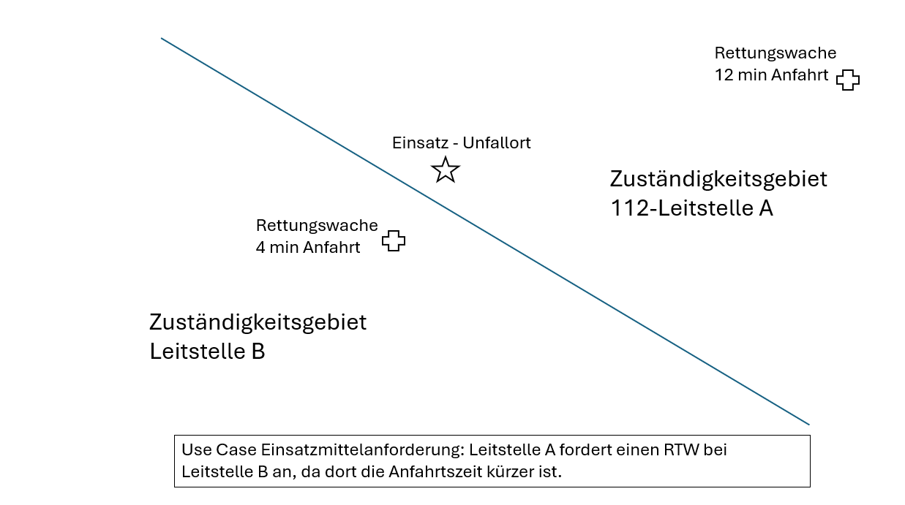
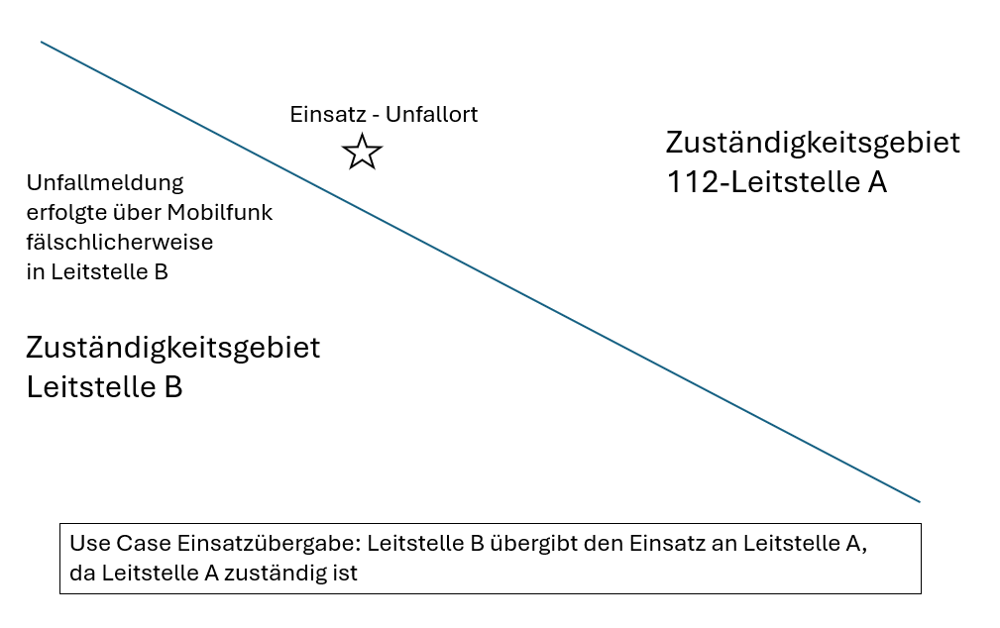

---
pdf_options:
  format: a4
  margin: 30mm 20mm
  printBackground: true
  headerTemplate: |-
    
    <section>
      Spezifikation UCRI2-App Einsatzmittelanforderung (resource_request) Version 1.0
    </section>
  footerTemplate: |-
    <section>
      

        Seite 
        von 
      

    </section>
---
# UCRI2-App Einsatzmittelanforderung

<!-- toc -->
<!-- tocstop -->
# Überblick
Der Use Case Einsatzmittelanforderung dient dazu, Einsatzmittel einer anderen Leitstelle als Unterstützung zur Einsatzbewältigung anzufordern. Beispiel: Leitstelle A bekommt einen Verkehrsunfall mit mehreren Verletzten im Grenzgebiet zu Leitstelle B gemeldet. Es werden 5 RTWs benötigt, Leitstelle A kann jedoch nur 4 RTWs im näheren Umfeld disponieren. Leitstelle A fordert bei Leitstelle B einen RTW zur Unterstützung an. Leitstelle B bestätigt die Unterstützung und entsendet entsprechende Einsatzmittel an A.

Die nachfolgenden Abbildungen verdeutlichen die Unterschiede zur Einsatz übergabe
Bei der Einsatzmittelanforderung verbleibt die Verantwortung für die Einsatzbewältigung in der anfordernden Leitstelle. Die Verantwortlichkeit resultiert i.A. wesentlich aus der örtlichen Zuständigkeit.

Bei der Einsatzübergabe wird die Verantwortung an die zuständige Leitstelle abgegeben. Im nachfolgend skizzierten Beispiel wurde die Einsatzmeldung in der falschen Leitstelle gemeldet (Überreichweiten…), so dass der Einsatz an die zuständige Leitstelle weiterzugeben ist.

# Ablaufbeschreibung

1. A->B Einsatzmittelanforderung (Konkretes Einsatzmittel oder allgemeine Anfrage z.B. RTW)
2. B->A Einsatzmittelanforderung vorläufig angenommen oder abgelehnt 
3. B->A Einsatzmittelbereitstellung 
4. B->A Bereitgestelltes EM ausgerückt 

Weitere Statusmeldungen werden nicht durch UCRI abgedeckt und können auf anderem Wege übernommen werden.

# App-Nachrichten
<!-- include ../../general_schema_documentation.md -->
<!-- include resource_request.schema.md -->
<!-- include acknowledgement.schema.md -->
<!-- include resource_acknowledgement.schema.md -->
<!-- include resource_deployed.schema.md -->