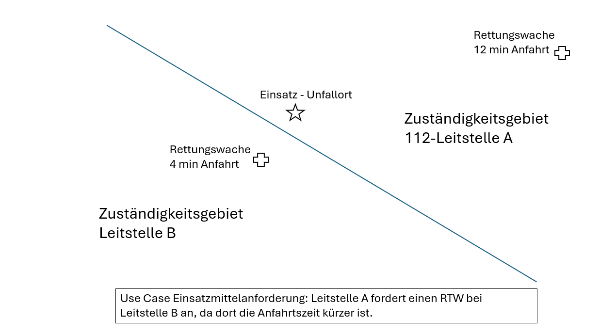
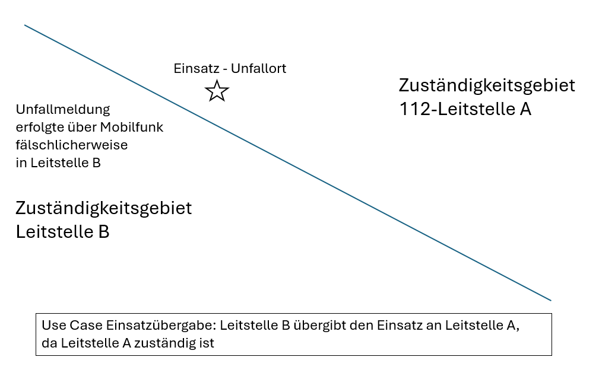

---
pdf_options:
  format: a4
  margin: 30mm 20mm
  printBackground: true
  headerTemplate: |-
    
    <section>
      UCRI2-Apps im Überblick
    </section>
  footerTemplate: |-
    <section>
      

        Seite 
        von 
      

    </section>
---

<b> UCRI2-Apps im Überblick   Zusatz zur Spezifikation Universal Control Room Interface (UCRI2) Version 2.0.0 </b>

# Vorwort

Ein Systemhersteller muss nicht alle UCRI2 Anwendungen unterstützen. Die Mindestanforderung: Wenn eine Anwendung unterstützt wird, dann müssen alle Schemata dieser Anwendung unterstützt werden. Falls für eine App Einschränkungen für diese Anforderung vorhanden sind, werden diese im Kapitel "Partielle Umsetzung" der jeweiligen App-Spezifikation genannt.

Die unterstützten Anwendungen werden über das KT-Register bekanntgegeben. Es ist dabei wichtig zu beachten, dass dies jeweils für eingehende Nachrichten als auch für ausgehende Nachrichten getrennt betrachtet werden muss.

Eine UCRI2-App verwendet JSON für Formatierung von Anwendungsnachrichten. Siehe JSON Schema Standardisierung: <https://json-schema.org/>.

Dieses Dokument gibt einen Überblick über die aktuell spezifizierten UCRI2-Apps (UCRI2-Anwendungen bzw. Use Cases). Detaillierte Informationen zu einzelnen Apps finden sich in den PDF-Dateien zu den jeweiligen Apps, die in den jeweiligen Kapiteln angegeben werden.

**Im Überblick werden folgende UCRI2 – Apps unterstützt:**

- App Einsatzübergabe (ohne Personen)
- App Einsatzübergabe (mit Patientendaten)
- App Patientenübergabe 112 -> 116117
- App Einsatzübergabe polizeilicher Einsatz
- App Einsatzmittelanforderung
- App Einsatzbezogener Nachrichtenaustausch
- App Patiententransport
- App Einsatzmitteltyp-Katalog-Abfrage
- App Einsatzstichwort-Katalog-Abfrage

---

# Anmerkungen zu Kooperativen Einsätzen

Beim kooperativen Einsatz in UCRI1 werden Einsatzdaten an die Nachbarleitstelle übergeben, ohne die Einsatzverantwortung vollständig mit abzugeben. Beide Leitstellen führen ihren Einsatz in Eigenverantwortung weiter und tauschen Nachrichten dazu aus. In UCRI2 wird dieser Ablauf durch 2 Apps, nämlich Einsatzübergabe und Einsatzbezogener Nachrichtenaustausch abgebildet. Zusätzlich erlaubt dieses Vorgehen den Nachrichtenaustausch in allen anderen Kontexten mit anzuwenden. Dementsprechend wurde in UCRI2 auf einen separten App Kooperativer Einsatz verzichtet.

---
# Unterschiedliche Arten der Einsatzübergabe

UCRI kennt unterschiedliche Formen (hier Apps) der Einsatzübergabe. Unter Einsatzübergabe wird generell die Weiterleitung eines Einsatzes inklusive Übergabe der Zuständigkeit für den Einsatz an den Empfänger verstanden.

Da es vor allem organisationsübergreifend unterschiedlichen Informationsbedarf bzw. auch Schutzbedarf der Daten gibt, wurden für die zu erwarteten unterschiedlichen Arten von Einsatzübergaben jeweils eigene Apps definiert. Dies ist insofern auch sinnvoll, da auf technischer Ebene von UCRI 2.0 die unterstützten Apps über eine Capability Abfrage technisch zur Verfügung gestellt werden können und der bilaterale Abstimmungsaufwand zwischen Kommunikationsteilnehmern damit auf ein Minimum reduziert werden kann.

Nachfolgende Tabelle skizziert die je nach Organisation zu erwartenden Apps, wobei die Auflistung nur beispielhaft, aber nicht abschließend ist.

| von/nach    | nach 110                                | nach 112 *)                                                                      | nach 116117             |
|-------------|-----------------------------------------|----------------------------------------------------------------------------------|-------------------------|
| von 110     | - Einsatzübergabe (ohne Personen)   - Einsatzübergabe polizeilicher Einsatz | - Einsatzübergabe (ohne Personen)                                                | -                       |
| von 112 )*  | - Einsatzübergabe (ohne Personen)       | - Einsatzübergabe mit Patientendaten   - Einsatzübergabe (ohne Personen)   - Einsatzmittelanforderung       | - Patientenübergabe     |
| von 116117  | -                                       | - Einsatzübergabe mit Patientendaten                                             | - Patientenübergabe     |

*) von / nach 112 steht hier stellvertretend auch für andere Einsatzzentralen, die im Anwendungsumfeld der Feuerwehr- und Rettungsdienstleitstellen arbeiten. Dazu zählen beispielsweise: Werkfeuerwehren, Waldbrandzentralen, Telenotarztsysteme, Krankentransportunternehmen, Hausnotrufzentralen und weitere.

**Anmerkung**: Für alle Arten der Einsatzübergabe ist optional ein Austausch von einsatzbezogenen Textnachrichten möglich, z.B. um Änderungen der Einsatzbedinungen zu kommunizieren oder einen kooperativen Einsatz durchzuführen. Hierzu kann die App "Einsatzbezogener Nachrichtenaustausch" genutzt werden. 

---

# App Einsatzübergabe (ohne Personen)
UCRI2-App-ID: incident_transfer

Aktuelle Version: 0.1

Aktuelle App-Dokumentation: incident_transfer_0.1.pdf

Bei der Einsatzübergabe entscheidet der Disponent einer Leitstelle (A), dass der Einsatz nicht in seinen Zuständigkeitsbereich fällt, sondern in den Zuständigkeitsbereich der Leitstelle (B). Die Leitstelle (B) kann sowohl aus organisatorischen Gründen - beispielsweise die Einsatzübergabe von einer Rettungsleitstelle an eine Polizeileitstelle als auch aus geografischen Gründen (Nachbarleitstelle) erfolgen. Dieser Use Case beschränkt sich bewusst auf die Kernelemente eines Einsatzes ohne jegliche strukturierte Datenobjekte für beteiligte Personen um mit den hier übermittelten Einsatzbasisdaten eine möglichst große Interoperabilität der am Markt befindlichen Systeme zu erreichen.
Die Einsatzübergabe via UCRI verfolgt das Ziel einer gesicherten Übergabe der Verantwortung/Zuständigkeit mit einer Datenübergabe ohne Medienbruch und mit minimalem Zeitverzug.
Dementsprechend wird die Übergabe durch einen Disponenten der empfangenen Leitstelle (B) fachlich, aktiv bestätigt (oder abgelehnt) und ist als Transaktion erst mit Empfang dieser Übernahmequittung in der Leitstelle (A) für diese abgeschlossen.  
UCRI regelt nicht, wie der Einsatz in der abgebenden Leitstelle (A) behandelt wird. Technisch und fachlich kann es durchaus möglich sinnvoll  sein, dass der Einsatz dann auch in Leitstelle (A) noch für Nachdokumentationen offen bleibt.

<!-- include ../../general_incident_app_notes.md -->

Diese App sieht zwei Rollen vor, die der abgebenden Stelle (A) und der annehmenden Stelle (B).

## Ablaufbeschreibung

1. A->B: Einsatz übergeben
2. B->A: Einsatz annehmen oder ablehnen
3. B->A: (optional) Einsatzendemeldung senden (falls Einsatz angenommen wurde)

# App Einsatzübergabe mit Patientendaten
UCRI2-App-ID: incident_transfer_with_patient

Aktuelle Version: 0.1

Aktuelle App-Dokumentation: incident_transfer_with_patient_0.1.pdf

Im Gegensatz zur Einsatzübergabe ohne Personendaten ist die Einsatzübergabe mit Patientendaten explizit dafür gedacht Einsätze zwischen Systemen übertragen zu können, die explizit mit Patientendaten arbeiten und mit den dafür spezifischen Zusatzinformationen von Patienten sinnvoll umgehen können. Typische Einsatzzwecke sind Einsatzübergaben Rettungsdienstleitstellen – sowohl von Rettungsleitstellen, als auch von 116117-Leitstellen aus.

Diese App sieht zwei Rollen vor, die der abgebenden Stelle (A) und der annehmenden Stelle (B).

## Ablaufbeschreibung

1. A->B: Einsatz übergeben
2. B->A: Fachliche Bestätigung durch den Disponenten: Einsatz annehmen oder ablehnen
3. B->A: (optional) Einsatzendemeldung senden (falls Einsatz angenommen wurde)

# App Patientenübergabe - Übergabe 112 -> 116117

UCRI2-App-ID: patient_transfer

Aktuelle Version: 0.1

Aktuelle App-Dokumentation: patient_transfer_0.1.pdf

Der Anwendungsfall Patientendatentransfer ist der Sonderfall der Einsatzübergabe zwischen einer 112-Leitstelle und einer 116117-Leitstelle. Hierbei ist die Richtung der Einsatzübergabe entscheidend - eine Übergabe von 116117 an 112 (Notfall-Eskalation) gleicht der regulären Einsatzübergabe und wird daher über den Use Case Einsatzübergabe (mit Patientendaten) abgebildet. Nur die Richtung von der 112 an die 116117 (Deeskalation eines nicht-Notfalls) besitzt spezifische Eigenschaften, die einen dedizierten Use case hierfür notwendig machen. Zusätzlich ist dieser Use Case für die Übergabe zwischen 116-117-Leitstellen anwendbar:

- Die Adressinformationen beschreiben keinen Einsatzort, sondern die Adresse des Patienten als Stammdateninformation

Wie bei der Einsatzübergabe wird auch der Patiententransfer durch die Empfänger-Leitstelle bestätigt oder abgelehnt.

Hinweis außerhalb der UCRI-Spezifikation: Neben den Datenanforderungen sind auch die Zeitrandbedingungen für die Einsatzübergabe gesondert zu betrachten. Bei der Einsatzübergabe zwischen 112-Leitstellen gelten die entsprechenden Hilfsfristen- und Reaktionszeiten gemäß der gesetzlichen Vorgaben. Bei der Einsatzübergabe von 112 in Richtung 116117 entfallen diese Reaktionszeiten.

<!-- include ../../general_incident_app_notes.md -->

Diese App sieht zwei Rollen vor, die der abgebenden Stelle (A) und der annehmenden Stelle (B).

## Ablaufbeschreibung

1. A->B: Einsatz übergeben
2. B->A: Einsatz annehmen oder ablehnen
3. B->A: (optional) Einsatzendemeldung senden (falls Einsatz angenommen wurde)

# App Einsatzübergabe polizeilicher Einsatz

UCRI2-App-ID: incident_transfer_police

Aktuelle Version: 0.1

Aktuelle App-Dokumentation: incident_transfer_police_0.1.pdf

Die Einsatzübergabe von polizeilichen Einsätzen wurde explizit als eigener Use Case mit aufgenommen, da bei der Bearbeitung von polizeilichen Einsätzen in der Regel beteiligte Personen mit den Rollen “Beschuldigter” und “Geschädigter” eine wichtige Rolle spielen. Systeme die diesen Use Case untertützen müssen daher auch explizit und strukturiert mit diesen Personendaten umgehen können. Beispiele für die Nutzung dieses Use Cases sind die Weitergabe von Einsätzen zwischen Polizeileitstellen, aber auch die Weitergabe von Einsatzinformationen an polizeiliche Vorgangsbearbeitungssysteme.
Diese App sieht zwei Rollen vor, die der abgebenden Stelle (A) und der annehmenden Stelle (B).

## Ablaufbeschreibung

1. A->B: Einsatz übergeben
2. B->A: Einsatz annehmen oder ablehnen
3. B->A: (optional) Einsatzendemeldung senden (falls Einsatz angenommen wurde)
4. 

# App Einsatzmittelanforderung

UCRI2-App-ID: resource_request

Aktuelle Version: 0.1

Aktuelle App-Dokumentation: resource_request_0.1.pdf

Der Use Case Einsatzmittelanforderung dient dazu, Einsatzmittel einer anderen Leitstelle als Unterstützung zur Einsatzbewältigung anzufordern. Beispiel: Leitstelle A bekommt einen Verkehrsunfall mit mehreren Verletzten im Grenzgebiet zu Leitstelle B gemeldet. Es werden 5 RTWs benötigt, Leitstelle A kann jedoch nur 4 RTWs im näheren Umfeld disponieren. Leitstelle A fordert bei Leitstelle B einen RTW zur Unterstützung an. Leitstelle B bestätigt die Unterstützung und entsendet entsprechende Einsatzmittel an A.

Die nachfolgenden Abbildungen verdeutlichen die Unterschiede zur Einsatz übergabe
Bei der Einsatzmittelanforderung verbleibt die Verantwortung für die Einsatzbewältigung in der anfordernden Leitstelle. Die Verantwortlichkeit resultiert i.A. wesentlich aus der örtlichen Zuständigkeit.

Bei der Einsatzübergabe wird die Verantwortung an die zuständige Leitstelle abgegeben. Im nachfolgend skizzierten Beispiel wurde die Einsatzmeldung in der falschen Leitstelle gemeldet (Überreichweiten…), so dass der Einsatz an die zuständige Leitstelle weiterzugeben ist.

## Ablaufbeschreibung

1. A->B Einsatzmittelanforderung (Konkretes Einsatzmittel oder allgemeine Anfrage z.B. RTW)
2. B->A Einsatzmittelanforderung vorläufig angenommen oder abgelehnt
3. B->A Einsatzmittelbereitstellung
4. B->A Bereitgestelltes EM ausgerückt

Weitere Statusmeldungen werden nicht durch UCRI abgedeckt und können auf anderem Wege übernommen werden.

# App Einsatzbezogener Nachrichtenaustausch

UCRI2-App-ID: notification_text

Aktuelle Version: 0.1

Aktuelle App-Dokumentation: notification_text_0.1.pdf

Diese UCRI2-App ermöglicht es, parallel zu anderen einsatzbezogenen Apps einen dynamischen Austausch von Textnachrichten zu unterstützen. Einzige Voraussetzung hierbei ist, dass für einen Einsatz bereits eine Übergabenachricht mit einer sharedIncidentId übermittelt wurde und diese sharedIncidentId dann in der Nachricht genutzt wird.
Nachrichten, die bereits existierende App-Nachrichten nachbilden (z.b. Einsatzannahme/-Ablehnung oder Einsatzendnachrichten) sind **nicht** als einsatzbezogene Textnachrichten zu übermitteln.
Die Nachrichten enthalten neben der sharedIncidentId eine Nachrichtenkategorie (Betreff), einen Nachrichtentext, einen Zeitstempel, sowie ein silent-Attribut, das angibt, ob die Nachricht in der empfangenden Leitstelle zwingend einem Disponenten vorzulegen ist.

## Ablaufbeschreibung

1. A->B: Einsatzbezogene Textnachricht übermitteln

# App Patiententransport

UCRI2-App-ID: patient_transport

Aktuelle Version: 0.1

Aktuelle App-Dokumentation: patient_transport_0.1.pdf

Der Anwendungsfall für den geplanten Patiententransport wird genutzt, um Einsätze für geplante Patiententransporte an eine andere Leitstelle bzw. Organisation zu übergeben. Die Pickup Locaton stellt in diesem Use Case dabei den Ort dar, an dem der Patient abgeholt werden soll (zB Krankenhaus oder Wohnadresse des Patienten).
Es ist entweder eine Abholzeit oder eine gewünschte Ankunftszeit am Transportziel zu setzen. Sind die Zeiten flexibel zu sehen, so soll dies textuell unter "AdditionalInfo" beschrieben werden. Ebenso muss der Zielort (Transportziel) zwingend befüllt sein.
Nach Bestätigung der Übergabe kann mit einer zusätzlichen Meldung (Acknowledgement) die tatsächliche Abholzeit des Patiententransports an die anfordernde Leitstelle gemeldet werden.
Wird die Transportanforderung abgelehnt, so kann ein Alternativ-Vorschlag der Abholzeit(alternativeProposal) unterbreitet werden. In einem solchen Fall wäre ein erneuter Request (neue Übergabe des Einsatzes) vom anfordernden System zu erstellen.

<!-- include ../../general_incident_app_notes.md -->

Diese App sieht zwei Rollen vor, die der terminsuchenden Stelle (A) und der terminvergebenden Stelle (B).

## Ablauf-Beschreibung

1.  A->B: Einsatz mit Patient und Zieltermin übergeben
2.  B->A: Übergabe bestätigen
3.  B-> A: Zieltermin übermitteln (optional)
4.  B->A: Übergabe ablehnen

# App Einsatzmitteltyp-Katalog-Abfrage

UCRI2-App-ID: resource_type_catalogue

Aktuelle Version: 0.1

Aktuelle App-Dokumentation: resource_type_catalogue_0.1.pdf

Der Anwendungsfall Einsatzmitteltyp-Katalog-Abfrage ermöglicht es, die in einem Leitsystem eingesetzten Einsatzmitteltypen abzurufen.
Ebenso wie bei den Stichworten, sind Einsatzmitteltypen nicht einheitlich
definiert. Aus diesem Grund besteht auch hier die Anforderung für ein
Mapping.
Grundsätzlich werden folgende Regeln definiert:
1. Die aussendende Leitstelle überträgt immer den in ihrem System
   definierten Einsatzmitteltyp.
2. Die empfangende Leitstelle mapped den fremden Einsatzmitteltyp
   auf einen in ihrem System definierten Einsatzmitteltyp.

Das konkrete Mapping einzelner Einsatzmitteltypen kann nicht
automatisiert, sondern nur manuell im Rahmen der Stammdatenpflege
durch einen autorisierten Mitarbeiter jeder beteiligten Leitstelle erfolgen.
Um das Einsatzmitteltyp Mapping zu optimieren, definiert diese App eine Methode zur Abfrage aller definierten
Einsatzmitteltypen einer Partnerleitstelle. Hierbei muss ein
Einsatzmitteltyp mit Kürzel und Beschreibung (Langtext) übergeben
werden. Somit können typische
Übertragungsfehler beim Austausch der Einsatzmitteltypen außerhalb des
Systems (z.B. eMail- oder FAX-Kommunikation) vermieden werden und für
den autorisierten Mitarbeiter innerhalb des Web-Service (UI-gestützte)
Mapping-Funktionalitäten realisiert werden.
Auch wenn Einsatzmitteltypen mit der Zeit nicht so häufig wie Stichworte
geändert werden, kann nicht garantiert werden, dass zu jedem Zeitpunkt
für jeden Einsatzmitteltyp ein Mapping vorhanden ist. Daher sollen nicht
gemappte Einsatzmitteltypen grundsätzlich an das empfangende
Einsatzleitsystem durchgereicht werden. Der Einsatz soll im empfangenden
System mit dem Hinweis zur Anzeige gebracht werden, dass ein
unbekannter Einsatzmitteltyp angefordert wird, damit der Disponent nach
Klärung den richtigen Einsatzmitteltyp zuordnen kann. Einsätze dürfen auf
keinen Fall wegen unbekanntem Einsatzmitteltyp unberücksichtigt bleiben.

## Ablaufbeschreibung
1.	A->B: Einsatzmitteltyp-Katalog-Anfrage senden
2.	B->A: Einsatzmitteltyp-Katalog übertragen

# App Stichwort-Katalog-Abfrage

UCRI2-App-ID: classification_catalogue

Aktuelle Version: 0.1

Aktuelle App-Dokumentation: classification_catalogue_0.1.pdf

Der Anwendungsfall Stichwort-Katalog-Abfrage ermöglicht es, die in einem Leitsystem eingesetzten Einsatzstichworte abzurufen.
Da bundesweit kein einheitlicher Stichwortkatalog definiert ist, ist für einen
möglichst reibungslosen Einsatzdatenaustausch ein Mapping der
Stichworte essentiell.
Aus diesem Grund werden folgende Regeln definiert:
1. Die aussendende Leitstelle überträgt immer das in ihrem System
   definierte Stichwort.
2. Die empfangende Leitstelle mapped das fremde Stichwort auf ein in
   ihrem System definiertes Stichwort.

Das konkrete Mapping einzelner Stichwörter kann nicht automatisiert,
sondern nur manuell im Rahmen der Stammdatenpflege durch einen
(autorisierten) Mitarbeiter jeder beteiligten Leitstelle erfolgen.

Um das Stichwort Mapping zu optimieren, definiert diese App eine Methode zur Abfrage des gesamten Stichwortkatalogs
einer Partnerleitstelle. Hierbei muss ein Stichwort mit Kürzel und
Beschreibung (Langtext) übergeben werden.
Somit können typische Übertragungsfehler beim Austausch der
Stichwortkataloge außerhalb des Systems (z.B. eMail- oder FAX-Kommunikation) vermieden werden und für den autorisierten Mitarbeiter
innerhalb des Web-Service (UI-gestützte) Mapping-Funktionalitäten
realisiert werden.

Da Stichwortkataloge mit der Zeit geändert/aktualisiert werden, kann nicht
garantiert werden, dass zu jedem Zeitpunkt für jedes Stichwort ein
Mapping vorhanden ist. Daher sollen nicht gemappte Stichwörter
grundsätzlich an das empfangende Einsatzleitsystem durchgereicht
werden. Der Einsatz soll im empfangenden System mit dem Hinweis zur
Anzeige gebracht werden, dass das Stichwort dem System unbekannt ist,
damit der Disponent z. B. ein passendes vorhandenes Stichwort auswählt
oder die Klärung einleitet. Einsätze dürfen auf keinen Fall wegen
unbekannter Stichworte unberücksichtigt bleiben.

## Ablaufbeschreibung
1. A->B: Stichwort-Katalog-Anfrage senden
2. B->A: Stichwort-Katalog übertragen

